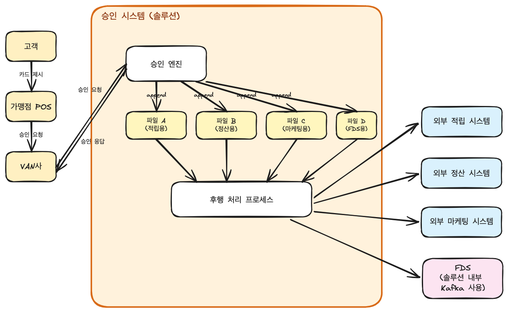
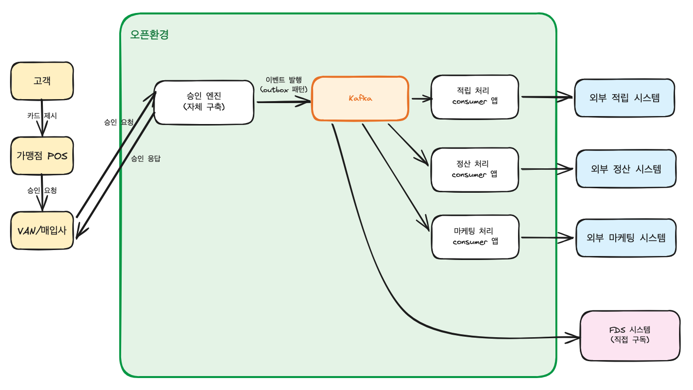

# F5 Kafka 사전 과제 제출

## 제출자

- 이름: 문건호
- 깃허브 계정: mgunho18@gmail.com

## 선택한 비즈니스 흐름

### 핵심 시나리오

- 카드 승인 후행 프로세스

### 이 흐름을 선택한 이유

- 구조적으로 복잡한 프로세스는 아니지만, 회사에서 이 후행 프로세스에 카프카를 녹이고 운영하는 것 관련해 고민을 하고 있어서 선택했습니다

## 과제 1-1. 현재 구조 도식화

### 전체 흐름도

### 등장하는 사용자/시스템/외부 연동

- 흐름도 참조

### 요청과 데이터 흐름

- VAN사가 카드사 승인 시스템으로 승인 요청 중계
- 승인 시스템에서 BL 정보 조회, 한도 조회/차감 등의 처리 후 승인/거절 응답
- 승인/거절처리 후 결과를 후행 처리용 파일들(consumer 종류별로 분리된 파일 N개)에 append
- 후행 처리 프로세스가 file write를 감지
- 후행 처리 프로세스가 외부 시스템(적립·정산·마케팅·FDS 등) 각각의 API를 호출
- 처리 실패시 retry를 일정 수준 시도하고 최종 실패건은 별도 file에 내용 적재

### 병목 또는 장애 포인트

- 특정 외부시스템 장애나 응답지연 시 다른 후행 프로세스가 영향을 받을 수 있음

### 현재 구조의 한계

- 솔루션 의존적
- 동일한 내용을 여러 대외기관에 broadcasting할때 기관별로 파일을 생성·관리해야함

## 과제 1-2. EDA/Kafka 적용 검토

### 적용 여부

- 솔루션 기반 환경에서 오픈 환경으로 이전한다는 전제로, 후행처리에 카프카가 적합하다고 판단

### 판단 근거

- 시스템 특징
    - 하루 발생 예상 메시지 건수 수천만건
    - 하나의 토픽을 여러 컨슈머그룹이 구독하는 fan out 구조 존재
    - FDS 등 일부 사내 시스템이 이미 Kafka 사용중

- 고려한 대안과 단점
    - file write 방식
        - file io 부하 우려
        - 동일한 내용을 여러 대외기관에 broadcasting할때 기관별로 파일을 생성·관리해야함
        - 솔루션을 그대로 구현하는 방식
    - DB queue (outbox polling)
        - 하루 수천만건의 메시지에 대한 polling 부하 우려
    - RabbitMQ 등 메시지큐
        - 대량 처리에 대한 부적합성
        - 특히 대외시스템 오류 발생시 producer에 back-pressure 가해질 수 있음

- 카프카 
    - 트래픽 규모에 적합
    - 컨슈머 그룹 단위 fan-out 가능
    - consumer 지연·장애 시에도 producer(승인 엔진)에 back-pressure가 가해지지 않음
    - FDS 등에서 직접 카프카에 붙어서 subscribe 할 수 있음

### 이벤트로 분리할 수 있는 흐름

- 메인 승인 처리 외 후행성 로직

### 이벤트 정의

- 승인 성공 / 취소
- BL 등록 / 취소 

### Producer / Consumer

### 동기 호출보다 낫거나, 낫지 않다고 판단한 이유

- 카드 승인 처리는 0.x초 단위로 이루어져야해서 외부의존성은 최대한 후행으로 빼야함

### 운영 시 주의할 점

- 멱등성: 동일한 승인내역이 여러번 전송되면 안됨
- 순서 보장: 카드별로 승인/취소 순서가 맞아야함
- 재처리: 멱등성 기반 재처리 이루어져야함
- 장애 복구: 유실이 되면 안되는 메시지는 outbox에 저장. 별도 유실에 대한 대사 작업도 두어야함

## 과제 2. Event Driven Architecture 핵심 개념 정리

### Event Driven Architecture란 무엇인가?

- 시스템 간 통신을 요청-응답(동기 호출)이 아니라 "사건이 일어났음"을 발행하고 관심 있는 쪽이 소비하는 방식으로 설계한 구조

### 어떤 상황에서 특히 유리한가?

- 하나의 사건에 관심 있는 후속 처리 주체가 여러 개일 때
- Producer와 Consumer의 변경 주기·확장 단위가 다를 때
- 장애 격리가 중요할 때
- 트래픽 버퍼링이 필요할 때

### 대표적인 단점이나 운영 비용은 무엇인가?

- 분산 시스템의 일반적 어려움: 멱등성 보장, 순서 보장, 재처리 정책을 각 consumer가 책임져야 함
- 트랜잭션 경계의 모호함: "DB 변경"과 "이벤트 발행"의 원자성 보장이 어려움 → outbox 같은 패턴으로 보완 필요
- 관측성 저하: 한 거래가 여러 consumer로 흩어지므로 동기 호출보다 디버깅이 어려움. 분산 추적·로그 상관관계 도구가 필요
- 인프라 운영 부담: Kafka의 경우 클러스터 운영, 모니터링, 보안 정책 등 새로운 전문성 필요
- 데이터 일관성: 결과적 일관성(eventual consistency)을 받아들여야 하는 경우가 많음. 강한 정합성이 필요한 영역에는 부적합

### Kafka는 EDA 안에서 어떤 역할을 하는가?

- Kafka는 EDA의 "이벤트 전달" 역할을 하면서, 동시에 "이벤트의 영속 저장소" 역할

### 내가 고른 비즈니스 흐름에서는 Kafka가 왜 필요하거나, 왜 아직 필요하지 않은가?

- 필요함.
  
- 결정적 명분:
    - 트래픽 규모 (일 수천만 건)
    - fan-out
    - FDS 등의 Kafka 호환

- 부가 명분:
    - 시장 표준성
    - 영속 로그의 부가 효과 (재처리, 감사 등)

## 참고 자료

-
