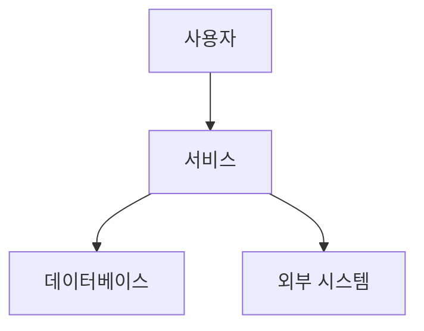

# F5 Kafka 사전 과제 제출

## 제출자

- 이름:
- 깃허브 계정:

## 선택한 비즈니스 흐름

### 핵심 시나리오

-

### 이 흐름을 선택한 이유

-

## 과제 1-1. 현재 구조 도식화

### 전체 흐름도

### 등장하는 사용자/시스템/외부 연동

-

### 요청과 데이터 흐름

-

### 병목 또는 장애 포인트

-

### 현재 구조의 한계

-

## 과제 1-2. EDA/Kafka 적용 검토

### 적용 여부

-

### 판단 근거

-

### 이벤트로 분리할 수 있는 흐름

-

### 이벤트 정의

-

### Producer

-

### Consumer

-

### 동기 호출보다 낫거나, 낫지 않다고 판단한 이유

-

### 운영 시 주의할 점

- 멱등성:
- 순서 보장:
- 재처리:
- 장애 복구:

## 과제 2. Event Driven Architecture 핵심 개념 정리

### Event Driven Architecture란 무엇인가?

-

### 어떤 상황에서 특히 유리한가?

-

### 대표적인 단점이나 운영 비용은 무엇인가?

-

### Kafka는 EDA 안에서 어떤 역할을 하는가?

-

### 내가 고른 비즈니스 흐름에서는 Kafka가 왜 필요하거나, 왜 아직 필요하지 않은가?

-

## 참고 자료

-
